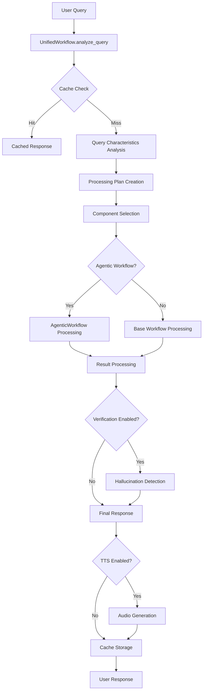

# Enhanced RAG System Architecture Analysis

## Executive Summary

This Enhanced RAG System is a comprehensive, production-ready implementation that has evolved from a basic LlamaIndex RAG application into a sophisticated State-of-the-Art (SOTA) system with intelligent orchestration, semantic caching, hallucination detection, multimodal capabilities, and performance optimization. The system demonstrates enterprise-level architecture patterns with proper separation of concerns, fallback mechanisms, and comprehensive monitoring.

## System Overview

The Enhanced RAG System implements a multi-tiered architecture centered around intelligent workflow orchestration. The system can dynamically choose between different processing paths based on query characteristics, system health, and performance requirements.

### Core Architecture Patterns

1. **Unified Orchestration Pattern**: Central coordinator (`UnifiedWorkflow`) that intelligently selects components
2. **Layered Fallback Strategy**: Graceful degradation from advanced features to basic functionality
3. **Plugin Architecture**: Modular components that can be enabled/disabled independently
4. **Configuration-Driven**: Extensive configuration management through `unified_config.py`
5. **Health-Aware Processing**: Real-time monitoring and adaptive behavior

## Component Analysis

### 1. Core Workflow Components

#### `src/workflow.py` - Main Entry Point
- **Purpose**: Primary workflow factory and legacy workflow support
- **Key Function**: `create_workflow()` - Intelligent workflow selection logic
- **Responsibilities**:
  - Environment variable loading and validation
  - Settings initialization via `init_settings()`
  - Workflow selection between UnifiedWorkflow, AgenticWorkflow, and base AgentWorkflow
  - Error handling and fallback to simpler workflows
  - Integration with citation system and query engine

#### `src/unified_workflow.py` - SOTA Orchestrator
- **Purpose**: Master orchestrator for all SOTA components
- **Architecture**: Event-driven workflow with two main steps:
  - `analyze_query`: Query analysis and cache checking
  - `execute_processing`: Component orchestration and execution
- **Key Features**:
  - Intelligent query complexity analysis
  - Dynamic processing plan creation
  - Component health monitoring integration
  - Cost optimization and constraint enforcement
  - Comprehensive fallback strategies

#### `src/agentic_workflow.py` - Enhanced Agent Processing
- **Purpose**: Advanced agentic capabilities with query decomposition and routing
- **Integration**: Wraps base AgentWorkflow with enhanced features
- **Capabilities**: Query routing, decomposition, parallel execution, result aggregation

### 2. Configuration and Settings Management

#### `src/settings.py` - Comprehensive Configuration
- **Purpose**: Centralized settings initialization and validation
- **Key Features**:
  - Multi-layered environment variable loading
  - Extensive validation for all component configurations
  - Support for RAG, agentic, cache, verification, and multimodal settings
  - Cost optimization and performance tuning parameters
  - Configuration getter functions for runtime access

#### `src/unified_config.py` - SOTA Configuration Management
- **Purpose**: Advanced configuration management with health monitoring
- **Architecture**: Dataclass-based configuration with component health tracking
- **Key Components**:
  - `PerformanceProfile` enum for different optimization strategies
  - `FeatureConfig` for individual component configuration
  - `ComponentHealth` for real-time health monitoring
  - Auto-enabling thresholds and fallback configurations

### 3. Semantic Caching System

#### `src/cache.py` - Redis-based Semantic Cache
- **Purpose**: High-performance semantic similarity caching with Redis backend
- **Architecture**: Embedding-based cache keys with cosine similarity matching
- **Key Features**:
  - Normalized embeddings for consistent similarity calculation
  - LRU eviction with TTL management
  - Performance statistics tracking
  - Graceful fallback to in-memory cache when Redis unavailable
  - Advanced similarity detection integration
  - Cost optimization tracking

**Technical Implementation**:
- Uses OpenAI embeddings for query representation
- Implements batched similarity search for performance
- Supports cache warming for common queries
- Comprehensive health checking and monitoring

### 4. Hallucination Detection and Verification

#### `src/verification.py` - Multi-Level Confidence System
- **Purpose**: Comprehensive hallucination detection with multi-level confidence calculation
- **Architecture**: Multi-stage verification pipeline with ensemble methods
- **Key Components**:
  - `NodeConfidence`: Individual node reliability scoring
  - `GraphConfidence`: Graph-level coherence analysis
  - `VerificationResult`: Standardized verification outcomes
  - GPT-4o-mini integration for verification tasks

**Confidence Calculation Methodology**:
- Node-level: Similarity, coherence, consistency, reliability (weighted combination)
- Graph-level: Cross-validation, consensus, coverage, redundancy analysis
- Response-level: Generation consistency and citation accuracy
- Ensemble verification for critical queries

### 5. Multimodal Capabilities

#### `src/multimodal.py` - CLIP-based Cross-Modal Processing
- **Purpose**: Text-image unified embedding space with cross-modal retrieval
- **Dependencies**: CLIP, OpenCV, Tesseract OCR (optional)
- **Features**:
  - Multiple CLIP model support (ViT-B/32, ViT-B/16, ViT-L/14)
  - Image quality assessment and filtering
  - OCR integration for text extraction from images
  - Cross-modal similarity calculation
  - Batch processing for performance optimization

### 6. Performance Optimization

#### `src/performance.py` - Advanced Performance Features
- **Purpose**: System-wide performance optimization and monitoring
- **Features** (inferred from usage patterns):
  - Advanced similarity detection with multi-level analysis
  - Batch processing optimization
  - Connection pooling for external services
  - Memory optimization strategies
  - Performance metrics collection

### 7. Supporting Components

#### `src/index.py` - Document Index Management
- **Purpose**: Vector index creation and management
- **Integration**: Works with sentence window indexing and hybrid search

#### `src/query.py` - Query Engine Factory
- **Purpose**: Creates optimized query engines with advanced retrieval features
- **Features**: Sentence windowing, hybrid search, reranking integration

#### `src/citation.py` - Citation System
- **Purpose**: Adds citation tracking and formatting to responses
- **Integration**: Seamlessly integrated across all workflow types

#### `src/generate.py` - Index Generation
- **Purpose**: Document processing and index creation for the `ui/data` directory

### 8. Text-to-Speech Integration

#### `src/tts.py` - Audio Output Generation
- **Purpose**: Convert text responses to speech for accessibility
- **Features**: Multiple TTS engine support (pyttsx3, gTTS)
- **Integration**: Automatic audio generation for substantial responses

### 9. Health Monitoring

#### `src/health_monitor.py` - System Health API
- **Purpose**: Comprehensive system health monitoring and alerting
- **Features**: Component health tracking, performance metrics, error alerting
- **Deployment**: Separate FastAPI service on port 8001

## Data Flow Analysis

### 1. Query Processing Pipeline

### 2. Component Interaction Flow

1. **Query Entry**: `workflow.py` → `create_workflow()`
2. **Orchestration**: `unified_workflow.py` → Query analysis and plan creation
3. **Processing**: Selected workflow (Unified/Agentic/Base) processes query
4. **Enhancement**: Components (cache, verification, multimodal) enhance processing
5. **Response**: Final response with citations, audio (optional), and caching

### 3. Configuration Flow

1. **Environment Loading**: `.env` files processed by `settings.py`
2. **Validation**: Multi-layered validation in `settings.py`
3. **Runtime Configuration**: `unified_config.py` provides runtime settings
4. **Health Monitoring**: Real-time component health tracking
5. **Adaptive Behavior**: Configuration influences component selection

## External Dependencies

### Core Dependencies
- **LlamaIndex**: Core RAG functionality, agents, workflows
- **OpenAI**: LLM and embedding models (GPT-4o, text-embedding-3-large)
- **LlamaDeploy**: Workflow deployment and UI integration

### Optional Enhancement Dependencies
- **Redis**: Semantic caching backend (graceful fallback available)
- **CLIP**: Multimodal capabilities (clip-by-openai)
- **Computer Vision**: OpenCV for image processing
- **OCR**: Tesseract for text extraction from images
- **TTS**: pyttsx3/gTTS for audio output

### Development Dependencies
- **FastAPI/Uvicorn**: Health monitoring API
- **NumPy**: Numerical computations for embeddings
- **Pillow**: Image processing

## Integration Points

### 1. UI Integration
- **Deployment**: LlamaDeploy serves UI on port 3000
- **Components**: Rich React/TypeScript components in `/ui/components/`
- **Features**: Enhanced citations, multimodal display, TTS controls, configuration panel

### 2. API Integration
- **Main Workflow**: Port 8000 (LlamaDeploy control plane)
- **Health Monitor**: Port 8001 (FastAPI service)
- **UI**: Port 3000 (LlamaDeploy UI server)

### 3. Storage Integration
- **Vector Index**: `/src/storage/` directory with JSON-based persistence
- **Document Source**: `/ui/data/` directory for indexable documents
- **Model Cache**: Configurable cache directories for CLIP models

## File Naming Issues and Refactoring Opportunities

### Current "unified_" Prefix Pattern
The system uses appropriate "unified_" prefixes for SOTA orchestration components:

1. **`src/unified_workflow.py`** - ✅ **Appropriate**: Master orchestrator for all SOTA components
2. **`src/unified_config.py`** - ✅ **Appropriate**: Centralized configuration management

These prefixes are justified because:
- They represent true unification/orchestration of multiple components
- They provide centralized management of distributed functionality
- They implement cross-cutting concerns (orchestration, configuration)

### No Refactoring Required
The current naming convention is consistent and semantically appropriate. The "unified_" prefix accurately reflects the role of these components as system-wide orchestrators and managers.

## Architecture Strengths

1. **Modular Design**: Components can be independently enabled/disabled
2. **Graceful Degradation**: Multiple fallback layers ensure system reliability
3. **Performance Optimization**: Intelligent caching and component selection
4. **Quality Assurance**: Multi-level verification and confidence scoring
5. **Extensibility**: Plugin architecture supports new features
6. **Monitoring**: Comprehensive health tracking and error handling
7. **Cost Management**: Built-in cost optimization and constraints

## Recommendations for Further Enhancement

1. **Metrics Dashboard**: Create comprehensive metrics visualization
2. **A/B Testing Framework**: Support for testing different configurations
3. **Advanced Caching**: Implement hierarchical caching strategies
4. **Model Ensemble**: Support for multiple LLM backends
5. **Real-time Learning**: Adaptive thresholds based on performance history
6. **Advanced Multimodal**: Support for audio and video content
7. **Distributed Processing**: Scale across multiple instances

## Conclusion

This Enhanced RAG System represents a sophisticated, production-ready implementation that successfully balances functionality, performance, and reliability. The architecture demonstrates enterprise-level design patterns with proper separation of concerns, comprehensive error handling, and intelligent adaptation to system conditions. The system is well-positioned for production deployment and future enhancements.